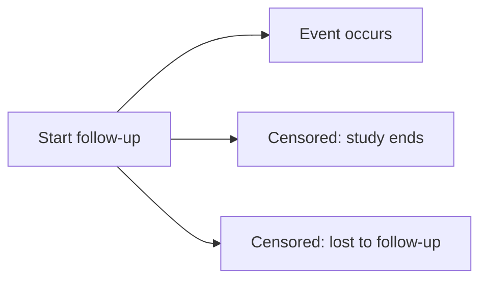

# 01. Why Survival Analysis?

Survival analysis is the branch of statistics used when your outcome is **time until an event happens** and some subjects **do not experience the event during follow-up** (they are **censored**).

In biostatistics, this appears constantly:

- **Clinical trials:** time to death, relapse, progression, adverse event
- **Epidemiology:** time to infection, disease onset, hospitalization
- **Health services:** time to readmission, ICU discharge
- **Devices / reliability:** time to implant failure

What makes survival analysis different from ordinary regression is that it uses **both**:
1) **the event indicator** (did the event happen?), and  
2) **the follow-up time** (when did it happen, or how long did we observe without it happening?).

---

## 1. The survival-data mindset

A survival study is like watching patients over time:

- Some have the event (e.g., death) during the study → we observe their event time.
- Some do not have the event before the study ends or they are lost → we only know they survived up to their last contact.

This “partial information” is not missing data. It is **valid information** that must be used correctly.

---

## 2. What counts as an “event”?

An **event** is the endpoint you care about, defined precisely.

Examples:
- **Death**
- **Relapse**
- **Hospital readmission**
- **Infection**
- **Device failure**

Your event must be **unambiguous**:
- What exactly qualifies as relapse?
- Is death from any cause counted, or only disease-specific death?
- If someone has two readmissions, is it the first only (time-to-first-event) or recurrent events?

(We cover competing risks and recurrent events later.)

---

## 3. What is censoring and why is it normal?

### 3.1 Right censoring (most common)
A subject is **right-censored** if the event has not occurred by the last time we observe them.

Common reasons:
- **Administrative censoring:** study ends while subject is event-free
- **Lost to follow-up:** subject stops coming, moves away, etc.
- **Withdrawal:** subject leaves the study

### 3.2 What censoring means
If a subject is censored at time 3 years, it means:

> They survived at least 3 years, but we do not know what happened after.

This is useful information.

### 3.3 A key assumption (often stated in papers)
Most standard survival methods assume **non-informative censoring**:

> Given the covariates in the model, censoring is independent of the event process.

If sicker patients are more likely to drop out (informative censoring), naive survival analysis can be biased.

---

## 4. Why not just use logistic regression?

A common approach is to pick a time horizon (say 5 years) and define:

- Event by 5 years: yes/no

Then use logistic regression.

### 4.1 Logistic regression loses timing
Consider two patients:

- Patient A dies at **1 month**
- Patient B dies at **59 months**
- Both are “dead by 5 years”

Logistic regression treats them the same, but clinically they are very different.

Survival analysis uses the full timing information.

### 4.2 Logistic regression struggles with unequal follow-up
Suppose the study is 5 years, but a patient is only followed for 2 years and is alive at last contact.

How do you label them for “dead by 5 years”?

- Exclude them → wastes data
- Label them “alive by 5 years” → wrong (we don’t know)
- Impute → adds strong assumptions

Survival analysis handles this naturally through censoring.

---

## 5. Why not compare mean time-to-event?

Another naive approach is to compare average survival times between groups.

Problem:
- Censored times are not true event times.
- The mean becomes biased unless censoring is handled explicitly.

Survival analysis methods are designed to incorporate censored follow-up properly.

---

## 6. What survival analysis gives you (biostat deliverables)

Survival analysis lets you estimate and report:

### 6.1 Kaplan–Meier survival curve
A nonparametric estimate of survival probability over time:
- 1-year survival
- 5-year survival
- median survival
- confidence intervals
- tick marks for censoring

### 6.2 Hypothesis testing: log-rank test
Compares entire survival curves between groups.

### 6.3 Regression modeling: Cox proportional hazards
Estimates effects of predictors (age, treatment, biomarkers) on the **hazard** via hazard ratios.

### 6.4 Extensions for real medical data
- **Time-dependent covariates** (treatment switching, biomarkers over time)
- **Parametric models** (Weibull, log-normal for extrapolation)
- **Competing risks** (death prevents relapse)
- **Frailty** (hospital/site clustering)
- **Recurrent events** (multiple infections/hospitalizations)

---

## 7. A clear visual intuition

### 7.1 Timeline: event vs censoring
Here’s the conceptual picture:

- “X” means event occurs
- “|” means censored

```
Patient 1: 0 ----------- X
Patient 2: 0 ------------------ |
Patient 3: 0 ----- X
Patient 4: 0 ---------- |
```

Survival analysis uses **all** the information from each line.

### 7.2 Diagram (Mermaid)



---

## 8. The survival data structure (what you store)

A minimal survival dataset has:

- `time`: follow-up time until event or censoring
- `event`: 1 if event, 0 if censored
- plus predictors (age, sex, treatment, biomarker, etc.)

Example:

| id | time | event | age | trt |
|---:|-----:|------:|----:|----:|
|  1 |  4.2 |     1 |  63 |   1 |
|  2 |  7.9 |     0 |  55 |   0 |
|  3 |  1.3 |     1 |  71 |   1 |

---

## 9. Simulation: build survival data (Python + R)

This simulation shows how survival data are created from:
- true event time \(T\)
- censoring time \(C\)
- observed time \(Y = \min(T, C)\)
- event indicator \(\delta = I(T \le C)\)

### 9.1 Python simulation

!!! interactive "Python"
    ```python
    import numpy as np
    import pandas as pd

    np.random.seed(101)

    n = 40

    # True event times (e.g., time to relapse)
    T = np.random.exponential(scale=10, size=n)

    # Censoring times (e.g., study end, dropout)
    C = np.random.uniform(2, 15, size=n)

    # Observed survival data
    time = np.minimum(T, C)
    event = (T <= C).astype(int)

    df = pd.DataFrame({
        "true_event_time_T": T,
        "censor_time_C": C,
        "observed_time": time,
        "event": event
    }).sort_values("observed_time")

    df.head(12)
    ```

**What to look for**
- `event = 1` means you truly observed the event time.
- `event = 0` means you only observed follow-up up to censoring time.

Try changing censoring intensity:
- More censoring: `C = np.random.uniform(2, 8, size=n)`
- Less censoring: `C = np.random.uniform(2, 25, size=n)`

---

### 9.2 R simulation

!!! interactive "R"
    ```r
    set.seed(101)

    n <- 40

    # True event times
    T <- rexp(n, rate = 1/10)   # mean = 10

    # Censoring times
    C <- runif(n, min = 2, max = 15)

    time <- pmin(T, C)
    event <- as.integer(T <= C)

    df <- data.frame(
      true_event_time_T = T,
      censor_time_C = C,
      observed_time = time,
      event = event
    )

    df <- df[order(df$observed_time), ]
    head(df, 12)
    ```

**Try**
- More censoring: `C <- runif(n, 2, 8)`
- Less censoring: `C <- runif(n, 2, 25)`

---

## 10. A short “why survival analysis” example (clinical reasoning)

Imagine a cancer study:

- Some patients relapse early (month 3)
- Some relapse later (month 30)
- Some never relapse during the study (censored)

A model that only uses “relapse yes/no” at a cutoff:
- ignores early vs late relapse
- mishandles different follow-up lengths

Survival analysis uses:
- exact timing when observed
- partial follow-up when censored
- and produces clinically interpretable curves and hazard ratios

---

## 11. Key takeaway

Use survival analysis when:
- The outcome is **time-to-event**, and/or
- There is **censoring**, and/or
- Follow-up times vary across participants.

Survival analysis is not just “another model.”  
It is the correct framework whenever **time and censoring are part of the outcome**.

---

## 12. Quick self-check exercises

<details>
<summary>Click to try</summary>

1. Give two reasons logistic regression is not ideal for time-to-event data.  
2. Explain censoring in one sentence, in plain language.  
3. In the simulation, increase censoring and compute the proportion censored. What happens to information?  
4. Give 3 biostat studies where the event is not death.

</details>
